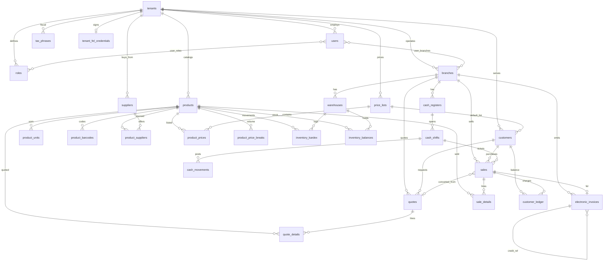

# 04 — Modelo de datos relacional

**Motor:** PostgreSQL 16+  
**Aislamiento:** `tenant_id` + RLS (documento 01)  
**Tipos:** `uuid` PK; montos `numeric(18,4)`; cantidades `numeric(18,6)`; timestamps `timestamptz`.

---

## 1. Diagrama ER (Mermaid)



---

## 2. Tablas de plataforma (sin RLS de ferretería)

### `tenants`

| Columna | Tipo | Notas |
| --- | --- | --- |
| id | uuid PK | |
| slug | citext unique | subdominio |
| legal_name | text | razón social |
| trade_name | text | |
| tax_id | text | NIT emisor |
| iva_affiliation | text | general / peq / exento… |
| status | text | `trial`, `active`, `suspended` |
| plan_id | uuid NULL | Fase 4 |
| created_at | timestamptz | |

### `platform_users`

SuperAdmins. Separados de `users` del tenant para no mezclar IAM.

### `plans` / `subscriptions` (Fase 4)

Límites: `max_users`, `max_branches`, `max_dte_month`.

### `audit_platform`

Impersonación, cambios de plan, suspensiones.

---

## 3. IAM del tenant

### `users`

| Columna | Tipo | Notas |
| --- | --- | --- |
| id | uuid PK | |
| tenant_id | uuid NOT NULL | |
| email | citext | unique `(tenant_id, email)` |
| password_hash | text | |
| pin_hash | text NULL | cajeros |
| mfa_secret_enc | bytea NULL | |
| is_active | bool | |
| full_name | text | |

### `roles`

`tenant_id`, `code` (`admin`, `cashier`, `warehouse`, `accountant`), `is_system`.

### `permissions` / `role_permissions` / `user_roles`

Catálogo global de códigos de permiso + asignación.

### `user_branches`

Scope de sucursal.

---

## 4. Organización comercial

### `branches`

| Columna | Tipo | Notas |
| --- | --- | --- |
| id | uuid PK | |
| tenant_id | uuid | |
| name | text | |
| sat_establishment_code | text | FEL |
| address_line, departamento, municipio, zip | text | |
| is_active | bool | |

Unique `(tenant_id, sat_establishment_code)` si no nulo.

### `warehouses`

`tenant_id`, `branch_id`, `code`, `name`, `kind` (`SELLABLE`, `STORAGE`, `TRANSIT`), `allow_negative`.

### `cash_registers`

`tenant_id`, `branch_id`, `code`, `device_fingerprint` NULL.

---

## 5. Catálogo

### `products`

| Columna | Tipo | Notas |
| --- | --- | --- |
| id | uuid PK | |
| tenant_id | uuid | |
| sku | text | unique `(tenant_id, sku)` |
| name | text | |
| description | text | |
| search_vector | tsvector | generado |
| base_unit_code | text | |
| allow_fractional | bool | |
| is_active | bool | |
| track_inventory | bool | |

### `product_units`

`id`, `tenant_id`, `product_id`, `unit_code` (`M`, `LB`, `QQ`, `YD`, `PLIEGO`, `GAL`, `UND`, `CAJA`…), `to_base_factor numeric(18,6)`, `is_default_pos`, unique `(product_id, unit_code)`.

### `product_barcodes`

`tenant_id`, `product_id`, `product_unit_id` NULL, `barcode` unique por tenant.

### `product_suppliers`

`tenant_id`, `product_id`, `supplier_id`, `supplier_sku`, `lead_time_days`, `is_preferred`.

### `price_lists`

`tenant_id`, `code` (`PUBLIC`, `WHOLESALE`, `CONTRACTOR`), `includes_vat` bool.

### `product_prices`

`price_list_id`, `product_id`, `product_unit_id` NULL (si null, precio en unidad default), `amount`.

### `product_price_breaks`

`product_id`, `price_list_id`, `min_qty_base`, `unit_price`.

---

## 6. Inventario

### `inventory_kardex`

| Columna | Tipo | Notas |
| --- | --- | --- |
| id | uuid PK | |
| tenant_id | uuid | |
| warehouse_id | uuid | |
| product_id | uuid | |
| qty_base | numeric(18,6) | +/- |
| unit_cost | numeric(18,4) | |
| reason | text | |
| ref_type | text | `sale`, `transfer`… |
| ref_id | uuid | |
| occurred_at | timestamptz | |
| created_by | uuid | |

**Append-only** (revoke = movimiento inverso). Sin UPDATE de `qty_base`.

### `inventory_balances`

PK `(warehouse_id, product_id)`; `qty_base`, `avg_cost`, `min_qty`, `reorder_point`, `reorder_qty`, `max_qty`, `updated_at`.

### `stock_transfers` / `stock_transfer_lines`

Cabecera de traslado entre almacenes.

---

## 7. Terceros

### `customers`

`tenant_id`, `code`, `name`, `tax_id` (NIT o `CF`), `email`, `phone`, `credit_enabled`, `credit_limit`, `credit_days`, `price_list_id`, `is_final_consumer`.

### `suppliers`

`tenant_id`, `name`, `tax_id`, `email`, `phone`, `lead_time_default`.

### `customer_ledger`

`tenant_id`, `customer_id`, `entry_type` (`CHARGE`, `PAYMENT`, `ADJUST`), `amount`, `ref_type`, `ref_id`, `occurred_at`. Saldo = suma (vista o proyección `customer_balances`).

---

## 8. Ventas, cotizaciones, caja, FEL

### `quotes`

`id`, `tenant_id`, `branch_id`, `customer_id`, `number` (unique por tenant), `status`, `valid_until`, `converted_sale_id`, `subtotal`, `vat_total`, `grand_total`, `created_by`.

### `quote_details`

`quote_id`, `product_id`, `unit_code`, `qty_commercial`, `qty_base`, `unit_price`, `discount`, `line_total`.

### `sales`

| Columna | Tipo | Notas |
| --- | --- | --- |
| id | uuid PK | idempotencia POS |
| tenant_id | uuid | |
| branch_id | uuid | |
| warehouse_id | uuid | descuento stock |
| cash_shift_id | uuid NULL | |
| customer_id | uuid NULL | |
| quote_id | uuid NULL | |
| number | text | correlativo **interno** |
| status | text | `confirmed`, `voided` |
| fiscal_status | text | `pending_fel`, `certified`, `fel_error` |
| payment_method | text | `cash`, `card`, `on_account`, `mixed` |
| price_list_id | uuid | |
| subtotal, vat_total, grand_total | numeric | |
| receiver_tax_id, receiver_name | text | snapshot FEL |
| created_at | timestamptz | |

### `sale_details`

Igual semántica que `quote_details` + `unit_cost` snapshot.

### `electronic_invoices`

| Columna | Tipo | Notas |
| --- | --- | --- |
| id | uuid PK | header Infile `identificador` |
| tenant_id | uuid | |
| sale_id | uuid NULL | NCRE/void pueden apuntar distinto |
| branch_id | uuid | |
| dte_type | text | `FACT`, `FESP`, `NCRE`, `NDEB` |
| status | text | ver doc 02 |
| uuid | text NULL | autorización SAT |
| series | text NULL | serie certificador |
| dte_number | text NULL | número DTE |
| authorization_number | text NULL | si el certificador lo separa del UUID |
| certification_at | timestamptz NULL | |
| xml_url | text NULL | |
| pdf_url | text NULL | |
| qr_payload | text NULL | |
| sat_response | jsonb | |
| error_code, error_message | text | |
| attempt_count | int | |
| next_retry_at | timestamptz | |
| referenced_invoice_id | uuid NULL | NCRE |
| provider | text | `INFILE` |

Unique parcial: un `FACT` certificado por `sale_id`.

### `cash_shifts`

`register_id`, `opened_by`, `opened_at`, `opening_amount`, `closed_at`, `closing_declared_amount`, `closing_system_amount`, `blind_diff`, `status` (`open`, `closed`).

### `cash_movements`

`shift_id`, `kind` (`SALE_CASH`, `PAYOUT`, `DROP`, `PETTY`, `OPENING`), `amount`, `reason`, `ref_id`.

### `tenant_fel_credentials`

`tenant_id` unique, campos `*_enc bytea`, `dek_id`, `establishment_default`. Nunca columnas en claro.

### `outbox_events`

`id`, `tenant_id`, `topic`, `payload jsonb`, `created_at`, `published_at`.

---

## 9. Índices para catálogo en tiempo real

Extensiones: `CREATE EXTENSION IF NOT EXISTS pg_trgm;` `CREATE EXTENSION IF NOT EXISTS unaccent;`

### 9.1 Identificadores exactos (POS pistola)

```sql
CREATE UNIQUE INDEX ux_products_tenant_sku
  ON products (tenant_id, sku);

CREATE UNIQUE INDEX ux_barcodes_tenant_code
  ON product_barcodes (tenant_id, barcode);
```

### 9.2 Trigramas (typos, “tornillo 3/8”, códigos parciales)

```sql
CREATE INDEX ix_products_name_trgm
  ON products USING gin (tenant_id, name gin_trgm_ops);

-- Si la versión/índice compuesto GIN no aplica, usar:
-- CREATE INDEX ix_products_name_trgm ON products USING gin (name gin_trgm_ops);
-- y siempre filtrar tenant_id (RLS + igualdad selectiva).

CREATE INDEX ix_products_sku_trgm
  ON products USING gin (sku gin_trgm_ops);
```

Consulta POS típica:

```sql
SELECT id, sku, name
FROM products
WHERE tenant_id = current_setting('app.tenant_id')::uuid
  AND is_active
  AND (sku ILIKE '%' || $1 || '%'
       OR name ILIKE '%' || $1 || '%'
       OR similarity(name, $1) > 0.25)
ORDER BY similarity(name, $1) DESC, sku
LIMIT 20;
```

Ajustar `pg_trgm.similarity_threshold` o usar `%` operator. Para 100k+ SKU: prefijo `ILIKE 'q%'` con índice btree `lower(sku)` además de GIN.

### 9.3 Full-Text Search (descripciones largas)

```sql
ALTER TABLE products
  ADD COLUMN search_vector tsvector
  GENERATED ALWAYS AS (
    setweight(to_tsvector('spanish', coalesce(sku,'')), 'A') ||
    setweight(to_tsvector('spanish', coalesce(name,'')), 'A') ||
    setweight(to_tsvector('spanish', coalesce(description,'')), 'B')
  ) STORED;

CREATE INDEX ix_products_fts
  ON products USING gin (search_vector);
```

Ferretería: FTS para “tubo pvc 1/2 higienico”; trigramas para códigos `H-1138` y errores de dedo. El API de búsqueda une ambos (RRF o priorización: barcode exacto → sku exacto → trgm → FTS).

### 9.4 Operación y FEL

```sql
CREATE INDEX ix_kardex_wh_prod_time
  ON inventory_kardex (warehouse_id, product_id, occurred_at DESC);

CREATE INDEX ix_sales_tenant_created
  ON sales (tenant_id, created_at DESC);

CREATE INDEX ix_sales_shift
  ON sales (cash_shift_id);

CREATE INDEX ix_einvoice_retry
  ON electronic_invoices (status, next_retry_at)
  WHERE status IN ('queued', 'retry_wait');

CREATE UNIQUE INDEX ux_einvoice_sale_fact
  ON electronic_invoices (sale_id)
  WHERE dte_type = 'FACT' AND status <> 'voided';

CREATE INDEX ix_customers_nit
  ON customers (tenant_id, tax_id);
```

### 9.5 RLS e índices

Todo índice de tablas tenant debe **empezar o filtrar** por `tenant_id` cuando la selectividad del tenant lo justifique (`btree (tenant_id, …)`). RLS no sustituye el índice: un seq scan de 50 M filas con filtro de política sigue siendo caro.

---

## 10. Convenciones

1. Todas las FK de negocio copian `tenant_id` y se valida que padre e hijo coincidan (trigger o columna generada).  
2. Soft-delete: `deleted_at` en catálogo; kardex y ventas no se borran.  
3. Migraciones Forward-only; jobs FEL idempotentes ante columnas nuevas.  
4. Particionado opcional Fase 4: `inventory_kardex` y `sales` por mes **dentro** del mismo tenant schema compartido (`PARTITION BY RANGE (occurred_at)`).

---

*Documento 4/5 — Modelo de datos. Versión 1.0 — 20 de septiembre de 2026.*
