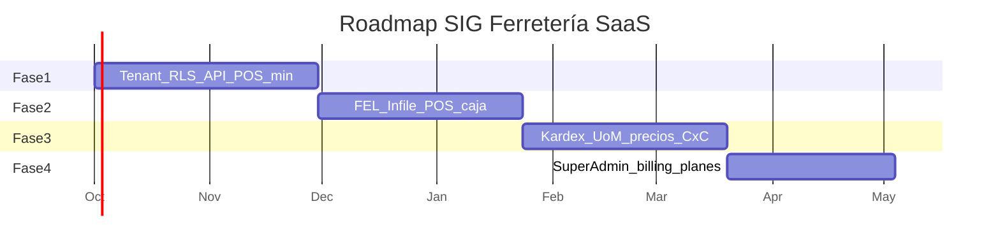

# 05 — Roadmap técnico de implementación

**Objetivo:** llevar el SIG de ferretería (hoy sin código en el repo) a un SaaS multi-tenant operable en mostrador, fiscalmente válido en Guatemala y vendible como suscripción.

Cada fase tiene **entrada**, **salida comprobable**, **fuera de alcance** y **riesgo**. No se abre la siguiente fase si los gates de la anterior están en rojo.

---

## Principios de ejecución

1. **Mostrador primero:** si una historia no mejora F2/F4 o no desbloquea FEL, baja de prioridad.  
2. **Un camino de datos:** RLS y `tenant_id` desde el commit 1; no “ya lo ponemos después”.  
3. **FEL asíncrono desde el día 1 del adaptador:** no construir POS síncrono para “luego sacar la cola”.  
4. **Vertical slices:** mejor “vender 1 SKU con ticket interno + job FEL fake” que “CRUD completo sin checkout”.

---

## Fase 1 — Aislamiento multi-tenant y backend en capas limpias

**Meta:** plataforma capaz de alojar N ferreterías en una sola API/Postgres sin fugas de datos, con POS mínimo online.

### Alcance

- Repos: `api`, `worker`, `infra` (Compose), `docs`.  
- Bounded contexts esqueléticos: Identity, Catalog, Sales, Inventory.  
- `TenantContext` + `set_config('app.tenant_id')` + RLS `FORCE` en tablas de negocio.  
- Auth: login por slug/subdominio, JWT, roles Admin / Cajero / Bodeguero / Contador (permisos base). SuperAdmin `platform_users` (CRUD tenants).  
- Postgres: migraciones de tablas núcleo (documento 04, sin FEL completo).  
- Redis: ping + cache de producto por SKU.  
- POS web: búsqueda F2, líneas, cobro efectivo F4, Esc, correlativo interno, impresora térmica simple.  
- Kardex mínimo: descuento al vender, un almacén por sucursal.  
- Tests de aislamiento: tenant A no lee productos de B (API + SQL directo con rol app).  
- Idempotency-Key en `POST /sales`.

### Gates de salida

| Gate | Evidencia |
| --- | --- |
| G1.1 | Suite CI “cross-tenant” en rojo si se quita un `WHERE tenant_id` (RLS lo cubre y el test lo afirma) |
| G1.2 | P95 búsqueda 10k SKU seed ≤ 150 ms en máquina de staging |
| G1.3 | Dos tenants en el mismo Compose venden en paralelo sin cruzar stock |
| G1.4 | Arquitectura: use cases sin SQL; Infile no referenciado aún (puerto con `FakeBillingProvider`) |

### Fuera de alcance Fase 1

Infile real, multibodega, CxC, cotizaciones, cierre Z ciego, SuperAdmin de billing SaaS.

### Estimación de equipo (orientativa)

4–6 sprints (equipo 3–5) si se parte de cero.

---

## Fase 2 — Adaptador FEL Infile + POS optimizado

**Meta:** cumplir SAT vía Infile sin congelar la caja; POS de ferretería usable 8 h de turno.

### Alcance

- `InfileBillingProvider` + `DteXmlBuilder` + TaxEngine IVA 12%.  
- Homologación: FACT NIT, FACT CF, anulación, NCRE sobre FACT de prueba.  
- Outbox + `worker-fel` + backoff + estados `electronic_invoices`.  
- Ticket interno inmediato; reimpresión con UUID/QR/PDF cuando `certified`.  
- Credenciales cifradas por tenant (KMS o vault dev).  
- Consulta NIT receptores.  
- POS: F3 listas de precio (3 listas, sin escalas de volumen aún), F6 receptor, pagos mixtos efectivo/tarjeta.  
- Caja: apertura, ventas efectivo, **cierre Z** (ciego opcional si hay tiempo; si se recorta, ciego va a Fase 3 pero Z sí).  
- Observabilidad: `fel_success_ratio`, edad de cola, traceId en ticket.

### Gates de salida

| Gate | Evidencia |
| --- | --- |
| G2.1 | Casos de prueba Infile/SAT firmados por contador de un tenant piloto |
| G2.2 | Chaos: timeout Infile → venta OK + retry + un solo UUID (idempotencia) |
| G2.3 | Secretos no aparecen en logs ni en JSON de API |
| G2.4 | Cajero piloto: venta promedio < 20 s con pistola (estudio informal UX) |

### Riesgos

Cambio de reglas SAT / frases; XML rechazado por redondeo. Mitigación: fixtures de XML homologado y golden file.

### Ambiente

Staging con credenciales laboratorio Infile; producción con go-live checklist documento 02.

---

## Fase 3 — Kardex avanzado, multialmacén y precios por volumen

**Meta:** operación real de ferretería con bodega, traslados, unidades fraccionadas y mayoreo.

### Alcance

- `warehouses` por sucursal; traslados; conteo/ajuste.  
- `product_units` (metro, lb, quintal, yarda, pliego, galón, unidad, caja) + barcodes por unidad.  
- Saldos y reorden por almacén; alertas por proveedor preferido; borrador de pedido.  
- `product_price_breaks` (escalas).  
- Cotizaciones + convertir a venta.  
- CxC: límite, ledger, cobros a cuenta.  
- Corte ciego de turno si no quedó en Fase 2.  
- Costo promedio ponderado en kardex.  
- Warm cache Redis top SKU.

### Gates de salida

| Gate | Evidencia |
| --- | --- |
| G3.1 | Venta 3.5 m y 1 caja 100 und cuadran kardex base |
| G3.2 | Traslado no crea ni destruye stock neto del tenant |
| G3.3 | Cliente sobre crédito no vende; admin override auditado |
| G3.4 | Cotización vencida no convierte silenciosamente a precio viejo (reprecio o confirmación) |

### Fuera de alcance Fase 3

MRP completo, múltiples compañías (NIT) bajo un login holding (se modela como varios tenants o Fase 4 “grupos”).

---

## Fase 4 — Panel SuperAdmin SaaS (suscripciones y límites)

**Meta:** la plataforma se cobra a sí misma; ops puede dar de alta ferreterías sin SQL.

### Alcance

- Planes: usuarios, sucursales, DTE/mes, almacenes.  
- `subscriptions` + portal de pago (tarjeta/transferencia GT — proveedor a elegir).  
- Enforcement: middleware de cuotas (HTTP 402/403 con código `PLAN_LIMIT`).  
- Panel SuperAdmin: tenants, estado FEL (cola, error rate), impersonación auditada, suspender por mora.  
- Factura **de la plataforma** al tenant (puede ser FEL del operador, NIT de la software house, mismo `BillingProviderInterface`).  
- Usage metering: ventas/mes, DTE certificados.  
- Onboarding wizard: slug, NIT, sucursal 1, usuario admin, prueba FEL sandbox.  
- Sharding docs: runbook si un tenant Enterprise pide DSN dedicado.

### Gates de salida

| Gate | Evidencia |
| --- | --- |
| G4.1 | Alta de tenant en < 15 min sin ingeniero |
| G4.2 | Exceso de sucursales bloqueado; upgrade lo desbloquea |
| G4.3 | Impersonación genera evento de auditoría inmutable |
| G4.4 | Runbook de restore PITR ensayado |

---

## Calendario relativo

Fechas ilustrativas a partir de oct-2026; ajustar al staffing real.

---

## Dependencias técnicas transversales

| Tema | Fase mínima | Nota |
| --- | --- | --- |
| Docker Compose local | 1 | Postgres 16, Redis, api, worker |
| Kubernetes / cloud | 2 | Antes del piloto con FEL prod |
| `pg_trgm` + FTS | 1 | Semilla de catálogo grande |
| Object storage XML/PDF | 2 | |
| KMS | 2 | Dev puede usar passphrase solo en local |
| OpenTelemetry | 1 (básico), 2 (SLO FEL) | |

---

## Equipo sugerido

| Rol | Fases |
| --- | --- |
| Arquitecto / tech lead | 1–4 |
| Backend (2) | 1–4 |
| Frontend POS | 1–3 |
| Contador / consultor FEL | 2 (crítico) |
| QA | 1–4 (aislamiento + fiscal) |
| DevOps | 2–4 |

---

## Métricas de éxito del programa

- **Técnicas:** NFR documento 01; ratio certificación FEL > 99% excluyendo SAT down; 0 incidentes de cruce de tenant.  
- **Producto piloto:** ticket promedio mostrador, % ventas con NIT vs CF, tiempo de cierre Z, quiebres de stock del top 200.  
- **SaaS:** churn, DTE/tenant, margen de infra por tenant activo.

---

## Secuencia de lectura para el equipo

1. [01-arquitectura-saas.md](./01-arquitectura-saas.md) — decisiones y NFR  
2. Este roadmap — qué construir cuándo  
3. [04-modelo-datos.md](./04-modelo-datos.md) — migraciones Fase 1  
4. [03-especificaciones-modulos.md](./03-especificaciones-modulos.md) — historias POS/kardex  
5. [02-integracion-infile-fel.md](./02-integracion-infile-fel.md) — spike + Fase 2

---

*Documento 5/5 — Roadmap de implementación. Versión 1.0 — 20 de septiembre de 2026.*
